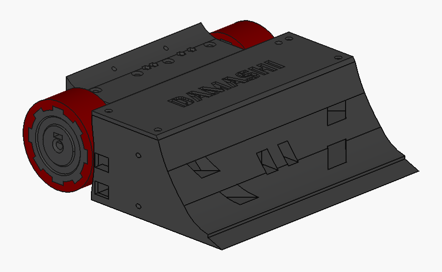

# Sumo DAMASHI

**Damashi** es un robot de sumo autónomo diseñado para competir en la disciplina de **<a href="https://lnr-argentina.com.ar/reglamentos/Reglamento%20Sumo.pdf" target="_blank">Sumo autónomo</a>** organizada por la **<a href="https://lnr-argentina.com.ar/" target="_blank">LNR</a>**.  

  

---

## 🚀 Características principales

| Especificación | Detalle |
|----------------|---------|
| **Dimensiones** | 190x190x65 mm |
| **Peso** | ≤ 2500 g |
| **Chasis** | Impreso en 3D |
| **Batería** | LiPo 4S |
| **Microcontrolador** | ESP32 DevKit V1 |
| **Sensores** | 3 x QRE1113GR (tatami) + 5 x SHARP GP2Y0A02YK0F de distancia (laterales y frontales) |
| **Motores** | APYS SP6 - 260 RPM |
| **Driver de motores** | BTS7960 |

---

## ⚡ Entradas / Salidas (I/O)

<table>
<tr>

<td>

### Entradas (sensores y botones)

| Pin ESP32 | Descripción |
|-----------|-------------|
| GPIO34 | SHARP_LEFT |
| GPIO35 | SHARP_RIGHT |
| GPIO32 | SHARP_MID_LEFT |
| GPIO33 | SHARP_MID |
| GPIO25 | SHARP_MID_RIGHT |
| GPIO26 | TATAMI_B (sensor tatami trasero) |
| GPIO27 | TATAMI_L (sensor tatami izquierdo) |
| GPIO13 | TATAMI_R (sensor tatami derecho) |
| GPIO17 | PUSH_2 |
| GPIO18 | PUSH_1 |

</td>

<td>

### Salidas (motores y otros)

| Pin ESP32 | Descripción |
|-----------|-------------|
| GPIO23 | M2B |
| GPIO22 | M2A |
| GPIO19 | M1A |
| GPIO21 | M1B |
| GPIO18 | BUZZER |
| GPIO05 | LED_1 |

</td>

</tr>
</table>

---

## 🛠 Tecnologías utilizadas

- **FreeCAD** → Diseño de piezas 3D (soporte de motores, chasis y demas piezas auxiliares)  
- **KiCad** → Diseño del PCB  
- **PlatformIO (VSCode)** → Firmware en ESP32 (C++ / Arduino framework)  

---

## 📂 Archivos

- `1_hardware_pcb/` → Archivos de KiCad (PCB + esquemas)  
- `2_hardware_chasis/` → Archivos Free
